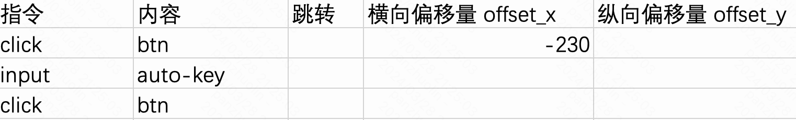

# auto-key

## 介绍

一个简单的自动化按键脚本工具。

## 如何运行

1. 首先安装 Python 环境
1. 安装所需的库
   ```shell
   pip install -r requirements.txt
   ```
1. 打开`main.py`即可运行

识图点击：


识图后依偏移量点击：


- 两个记事本的关闭按钮图形一样，都是“ X ”，单纯识别“ X ”可能会误操作，这是就需要识别标题再根据标题偏移“ offset_x ” “ offset_y ”位置，再进行点击。

  > 指令类型 1/2/3
  > 内容 设置 图片名称，例如：“1.png”
  > 横向偏移量 offset_x 设置 依 识别到图片后所确认的图片中心位置 横向偏移多少个像素单位，默认值 0 不偏移，直接点击 图片中心位置
  > 纵向偏移量 offset_y 设置 依 识别到图片后所确认的图片中心位置 纵向偏移多少个像素单位，默认值 0 不偏移，直接点击 图片中心位置

模拟快捷键：


- 模拟按下 “Win+R”

  > 指令类型 7
  > 内容 设置 快捷键 格式：按键以加号相连，例如：“Win+R”

鼠标长按与拖动


模拟鼠标按住并拖动，在 “无标题 - 画图” 中画一条直线

> 指令类型 8
> 内容 设置 持续时间多少秒
> 横向偏移量 offset_x 设置 依 鼠标当前位置 横向偏移多少个像素单位，默认值 0 不偏移，直接在鼠标当前位置长按
> 纵向偏移量 offset_y 设置 依 鼠标当前位置 纵向偏移多少个像素单位，默认值 0 不偏移，直接在鼠标当前位置长按

调用 CMD


模拟执行“1.bat”，1.bat会调用2.ps1（可编辑1.bat实现提权），用于收集系统信息写入“info.txt”

> 指令类型 9
> 内容 设置 bat名称，例如 1.bat

> 你可以通过调用bat，调用Powershell、[KeymouseGo](https://github.com/taojy123/KeymouseGo) 或是其他，完成更复制的自动化。

次要图片功能（同一条指令可指定不同图片）




## 切换交互

通过更改`config.json`中的`interaction`字段来切换交互

| 选项           | 说明         |
| -------------- | ------------ |
| `command_line` | 命令行交互   |
| `gui`          | GUI 界面交互 |

你也可以在`interaction`包下添加自定义交互，然后在`interaction.factory`中注册你的交互即可。

## 图形界面版全局快捷键

- `F6` 运行脚本

- `F9` 暂停脚本 （鼠标移至屏幕左上角也可暂停）

  可以在 `./executor/external.py`中的`Comic`类修改快捷键按键设置

## 目录结构

```
📁 auto-key/
├─📄LICENSE
├─📜main.py                     # auto-key入口
├─✏️README.md
├─✏️requirements.txt             # 依赖库
├─📁 scripts/                   # 脚本存放处
├─📁 context/
│ ├─📜logging.py
├─📁 executor/                  # 规定了脚本执行器接口
│ └─📁 simple.py/               # 最简单的脚本执行器
│ ├─📜external.py               # 存放外部需要访问的实体类
├─📁 interaction/               # 规定了交互接口
│ ├─📁 command_line.py          # 命令行交互
│ └─📁 gui.py                   # 图形界面交互
│ ├─ ├─📄auto_key.ui
│ ├─ ├─📜main.py
│ ├─ ├─📜shortcut_handler.py
│ ├─ ├─📜Ui_auto_key.py
├─📁 scripts/                   # 脚本存放文件夹
│ ├─📁 test_calc/
│ ├─ ├─✏️meta.json
│ ├─📁 test_csv_file_script/
│ └─📁 test_script/
│ ├─✏️meta.example.json          # meta.json的示例
└─📁 script_loader/             # 脚本加载器，规定了一些关于脚本加载有关的接口
  └─📁 excel.py                 # Excel脚本加载器
```

## 编写脚本

你可以参照`script`目录下面的`test_script`
来实现专属于你的脚本，只要创建一个脚本的文件夹，名字随便定，记得配置好脚本信息`meta.json`。

目前仅支持`Excel`脚本的方式，你可以通过在`script_loader`目录下创建实现了`main.py`中的`ScriptLoader`接口的类的文件来创建属于自己的脚本解析方式。